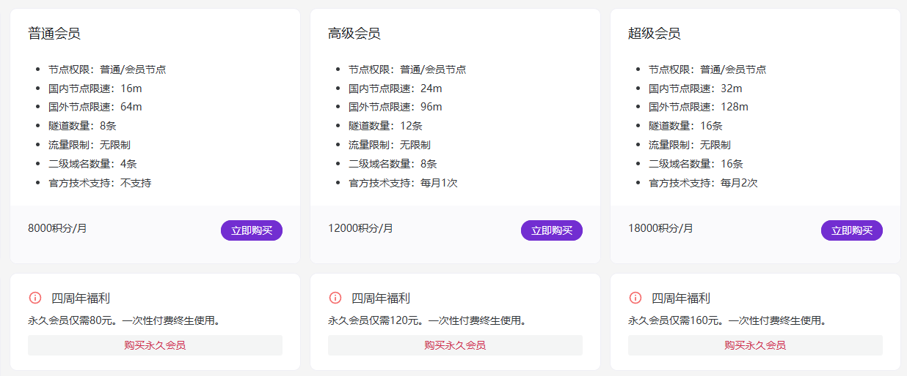

在和朋友mc联机的时候经常用到frp（主要是花生壳免费no 樱花限流量no）

翻来翻去找到了一个“好东西”

[https://www.chmlfrp.cn/](https://www.chmlfrp.cn/)

进入管理面板注册账号

若官网无法访问时

[v2镜像站（不推荐使用）](https://v2-cf.milkymay.top/)

[v3镜像站](https://panel-cf.milkymay.top/)

[v3镜像站-cf（较慢）](https://panel--cf.milkymay.top/)

[v3镜像站-eo](https://chmlfrp-panel-mitbaoyu.edgeone.run/?eo_token=5cacda08b67dfac23f2cb748778e6c34&eo_time=1754743037)

注册完账号后最好进行实名验证（不然用不了国内节点）

这里配置相关教程网上很多 

如：

[csdn 文档](https://blog.csdn.net/MC_chaoji/article/details/135036174)

[bilibili 视频教程](https://www.bilibili.com/video/BV1KK421k7WX/)

以上均为v2版本教程（以后回考虑自己写v3教程滴）

免费账号的限额是（现在）：

国内节点限速：8m

国外节点限速：32m

流量限制：无限制

隧道数量：4条

感觉还不错，就是最好用一些比较稳定的节点（比如：湖北十堰 实测挺稳定的）

以下为付费内容：

感觉还好积分可以白嫖嘿嘿

永久超级会员往后还可以进行定制：

隧道：10元/条   带宽：10元/mbps

均为永久
