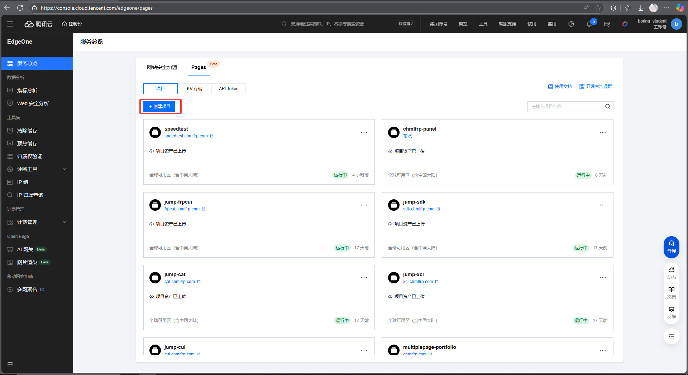
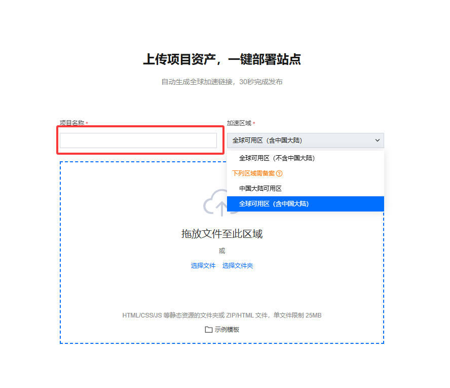
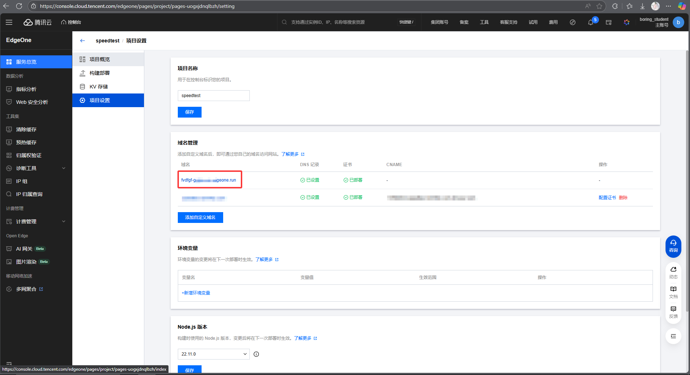
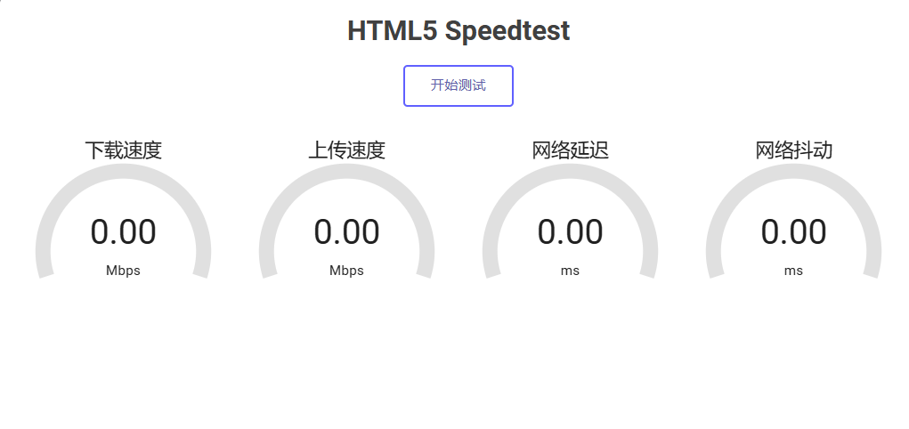
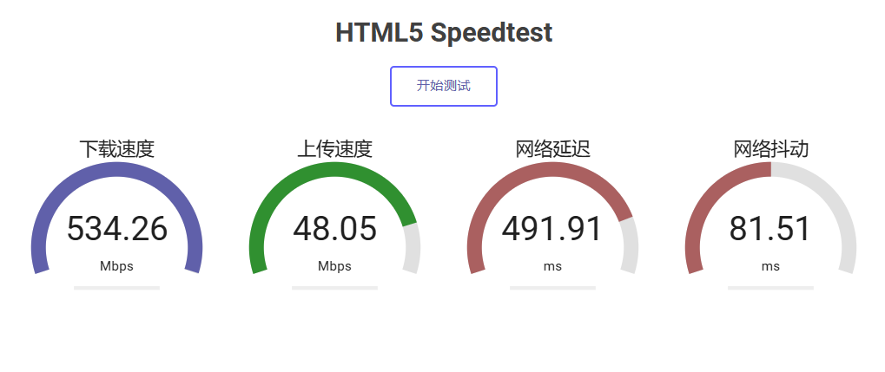

# 使用EdgeOne搭建自己的测速网站

最近，腾讯云旗下的EdgeOne发布了免费套餐的获取方式

既然是免费的，那就不得不白嫖了 嘿嘿

## 咋用上EdgeOne？

1. 使用浏览器访问： https://edgeone.ai 进行注册账号
2. 获取EdgeOne的免费资格（网上已经有很多教程，这里我就不多赘述了）

## 部署测速网页到eo page

[下载代码文件](https://cloud.chmlfrp.com/speedtest.7z)


然后在浏览器打开 [https://console.cloud.tencent.com/edgeone/pages](https://console.cloud.tencent.com/edgeone/pages)

登录完成后



点击"创建项目" 选择直接上传



1. 项目名称随意

2. 加速地区

这里如果没有绑定自己域名的需求

可以随意选择  推荐: 全球可用区（含中国大陆）

如果需要绑定自己的域名

```python
if "域名icp备案" == False:
    print("请选择 全球可用区（不含中国大陆）")
else:
    print("请在下载的代码文件中 index.html 末尾添加自己的备案号")
```

部署完成后点击项目设置



在域名管理这一栏中eo会默认分配一个域名供我们使用

若需绑定域名请选择 添加自定义域名 按照指引进行配置即可

## 测试咯！
在浏览器打开绑定的域名

点击开始测试即可


实测下来可以跑满我家的家宽

还是非常不错的nice！